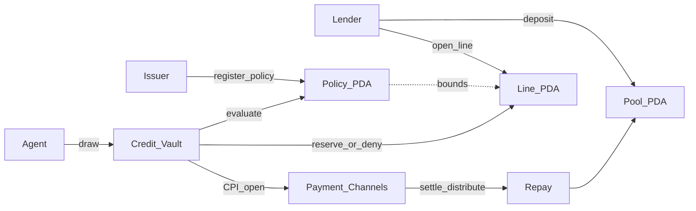

# Zeta Labs

**Policy-bounded credit for Solana agents.**

A lender deposits USDC into a vault. An agent receives a credit line bound by
an on-chain policy (per-call cap, expiry, instant revoke). Every spend is
evaluated before anything moves. Settlement rides the real Payment Channels
`open` → x402 `upto` path — the agent never holds unconstrained draw USDC.

**Colosseum Crypto World's Fair** · 23 Sep → 12 Oct 2026  
**Team:** Demilade (Vault + Policy) · Anurag (pay-kit / spend) · Joshna (SDK + dashboard)


---

## Why this exists

Agents are starting to buy their own inference, APIs, and compute. Every
payment standard shipped for them in the last year assumes the same thing:
that you have a card that works internationally.

- **x402** (Coinbase/Cloudflare, May 2025) — per-request stablecoin payments
- **AP2** (Google, Sept 2025) — a signed spending mandate, backed by Amex,
  Mastercard, PayPal and 60+ organisations
- **MPP** (Stripe/Tempo, Mar 2026) — session-based agent billing

AP2 and MPP settle on card rails. That is fine in San Francisco. It is not
fine in Lagos.

Nigerian banks suspended naira cards for international payments in 2020 and
restored them only in **July 2025**, at roughly **$500/month — about $4,000 a
year**, under one-tenth of the 2015 floor. Most naira debit cards still carry a
**$0 international limit**. **Verve, Nigeria's most-used card network, is not
accepted by AWS at all.** Two failed payments suspends a cloud account.

A developer in Lagos cannot hand an autonomous agent a card that does not work.
They are structurally excluded from agentic commerce at the exact moment it is
being standardised.

**Zeta is credit that needs no card, no bank, and no FX approval.** A lender
deposits USDC into a program-owned pool. An agent draws against a policy-bounded
credit line. Every spend is evaluated on-chain before anything moves.

### Per-call caps are theatre

And the enforcement has to be real, because at a $500 monthly ceiling an
overrun is not a rounding error — it is 40% of the month.

A 1.00 USDC per-call cap still lets an agent move 20.00 USDC in twenty
individually legal calls. "SoK: Blockchain Agent-to-Agent Payments"
(arXiv:2604.03733, 2026) names this as open:

> "Authorization policies constrain individual transactions. However, they do
> not capture the execution history, cumulative spend, or multi-step
> strategies. Sequences of valid transactions may violate intended spending
> boundaries through repetition, fragmentation, or timing manipulation."

Zeta's windowed accumulator bounds the sequence. See it in 30 seconds:

```bash
cd packages/sdk
npm run demo:fragmentation -- --undefended   # per-call cap only: 20.00 USDC drained
npm run demo:fragmentation                   # accumulator on: stopped at 5.00 USDC
```

Read-only, no keypairs. The exact bounds and every test are in
[`docs/WEDGE.md`](docs/WEDGE.md); market and business model in
[`docs/POSITIONING.md`](docs/POSITIONING.md).

---

## What Phase 1 proves

| Claim | Evidence |
| --- | --- |
| Shared contract frozen Day 1 | `crates/zeta-interface` · `INTERFACE_VERSION = 1` |
| Policy Registry live on Devnet | [`G1Kq…c6gk`](https://explorer.solana.com/address/G1KqFJPuxkCDGxTMjSPSsD6hh3ZBA6hqv2NGpfhfc6gk?cluster=devnet) |
| Credit Vault live on Devnet | [`4M9ee…mMHi`](https://explorer.solana.com/address/4M9eej8FKXzwgwRKKN3uy5bUfuAXp1aS7ewc7he9mMHi?cluster=devnet) |
| Programs allocate their own PDAs | [`docs/PDA.md`](docs/PDA.md) |
| Deny never reserves | Host e2e + processor tests |
| Seven-step spend submit on Devnet | `packages/sdk` · `npm run devnet:spend-submit` |
| Ops dashboard reads live accounts | `packages/dashboard` |

Honest status (what we will not claim): [`docs/STATUS.md`](docs/STATUS.md) · Phase 1 snapshot: [`docs/PHASE1.md`](docs/PHASE1.md)

---

## Technical architecture



**Evaluate order (frozen):** revoke → expiry → per-call cap.

**Draw order:** evaluate → audit log → (deny: stop, no write) → reserve → encode
Payment Channels `open` → optional CPI with pool PDA as payer.

| Layer | Location |
| --- | --- |
| Layouts, codecs, builders, pay-kit open encoding | [`crates/zeta-interface`](crates/zeta-interface) |
| Policy program | [`programs/policy-registry`](programs/policy-registry) |
| Vault program | [`programs/credit-vault`](programs/credit-vault) |
| TS SDK + spend API | [`packages/sdk`](packages/sdk) |
| Read-only ops UI | [`packages/dashboard`](packages/dashboard) |
| Account / ix contract | [`docs/INTERFACE.md`](docs/INTERFACE.md) |
| Program IDs | [`docs/PROGRAM_IDS.md`](docs/PROGRAM_IDS.md) |


---

## Repo map

| Path | Owner | What |
| --- | --- | --- |
| `crates/zeta-interface` | all three (frozen) | Account layouts, `evaluate`, draw→channel mapping |
| `programs/credit-vault` | Demilade | `create_pool`, `deposit`, `open_line`, `draw`, `repay` |
| `programs/policy-registry` | Demilade | `register_policy`, `evaluate`, `revoke` |
| `packages/sdk` | Anurag + Joshna | Decoders, builders, `spend` / `submitAgentSpend`, Devnet scripts |
| `packages/dashboard` | Joshna | Lender / agent / policy / audit panels |
| `docs/` | all | Interface, PDA path, status, Phase 1 |

---

## Quickstart

### Programs (host tests)

```bash
cargo test --workspace
```

### SDK (npm)

```bash
npm install @zetasdk/sdk @solana/web3.js
```

Docs and quickstart: [`packages/sdk/README.md`](packages/sdk/README.md).

### SDK Devnet proof (from repo)

```powershell
cd packages/sdk
npm ci
npm run devnet:preflight
npm run devnet:spend-submit -- --submit --skip-x402
npm run devnet:policy-demos -- --submit
```

### Dashboard

Live ops UI (Devnet discovery + demo fallback):
**https://zetalabsx.vercel.app**

```powershell
cd packages/dashboard
npm ci
npm run dev
```

Open the Vite URL. Live discovery hits Devnet; Connection settings can pin pool /
line / policy. Labelled demo data appears if discovery finds nothing.

---

## Devnet IDs

| Program | ID |
| --- | --- |
| Policy Registry | `G1KqFJPuxkCDGxTMjSPSsD6hh3ZBA6hqv2NGpfhfc6gk` |
| Credit Vault | `4M9eej8FKXzwgwRKKN3uy5bUfuAXp1aS7ewc7he9mMHi` |
| Payment Channels | `CHNLxYvVA28MJP9PrFuDXccuoGXAx7jBacfLEkahyGsX` |
| Devnet USDC | `4zMMC9srt5Ri5X14GAgXhaHii3GnPAEERYPJgZJDncDU` |

---

## What is next (Phase 2 — do not claim yet)

- P4 category allowlist / token ACL
- P5 rolling + total caps
- Swig delegated authority for line→agent grants
- Production x402 merchant endpoint (Phase 1 can use playground / `--skip-x402`)

---

## Standing rules

- One Builder Feed post every 24h during the Fair.
- No naira/rupee on-ramp, no merchant network, no human consumer wallet product.
- Shared types change only by agreement (`INTERFACE_VERSION`).
- Traction beats feature sprawl after Day 14.

See [`docs/SPRINT.md`](docs/SPRINT.md) for the 3-person plan.
