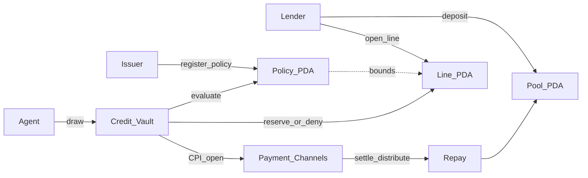

# Zeta Labs

**Policy-bounded credit for Solana agents.**

A lender deposits USDC into a vault. An agent receives a credit line bound by
an on-chain policy (per-call cap, expiry, instant revoke). Every spend is
evaluated before anything moves. Settlement rides the real Payment Channels
`open` → x402 `upto` path — the agent never holds unconstrained draw USDC.

**Colosseum Crypto World's Fair** · 23 Sep → 12 Oct 2026  
**Team:** Demilade (Vault + Policy) · Anurag (pay-kit / spend) · Joshna (SDK + dashboard)


---

## Why this exists

Autonomous agents are starting to buy APIs, inference, and services on their
own. Today that usually means one of two bad options:

1. **Give the agent a hot wallet** full of USDC — and hope prompts + off-chain
   guards are enough when something goes wrong.
2. **Keep a human in the loop** for every payment — which kills the point of
   an agent.

Zeta is the third path: **credit with teeth**. Capital stays in a program-owned
pool. The agent can only draw what policy allows. Deny paths emit an audit
record and **do not reserve**. A lender can revoke and stop the next draw
immediately.

We are building this for Colosseum World's Fair on Solana because the settlement
leg is not fake: Payment Channels + x402 `upto` already exist. Zeta supplies the
missing **policy-bounded credit layer** in front of them.

---

## What Phase 1 proves

| Claim | Evidence |
| --- | --- |
| Shared contract frozen Day 1 | `crates/zeta-interface` · `INTERFACE_VERSION = 1` |
| Policy Registry live on Devnet | [`G1Kq…c6gk`](https://explorer.solana.com/address/G1KqFJPuxkCDGxTMjSPSsD6hh3ZBA6hqv2NGpfhfc6gk?cluster=devnet) |
| Credit Vault live on Devnet | [`4M9ee…mMHi`](https://explorer.solana.com/address/4M9eej8FKXzwgwRKKN3uy5bUfuAXp1aS7ewc7he9mMHi?cluster=devnet) |
| Programs allocate their own PDAs | [`docs/PDA.md`](docs/PDA.md) |
| Deny never reserves | Host e2e + processor tests |
| Seven-step spend submit on Devnet | `packages/sdk` · `npm run devnet:spend-submit` |
| Ops dashboard reads live accounts | `packages/dashboard` |

Honest status (what we will not claim): [`docs/STATUS.md`](docs/STATUS.md) · Phase 1 snapshot: [`docs/PHASE1.md`](docs/PHASE1.md)

---

## Technical architecture



**Evaluate order (frozen):** revoke → expiry → per-call cap.

**Draw order:** evaluate → audit log → (deny: stop, no write) → reserve → encode
Payment Channels `open` → optional CPI with pool PDA as payer.

| Layer | Location |
| --- | --- |
| Layouts, codecs, builders, pay-kit open encoding | [`crates/zeta-interface`](crates/zeta-interface) |
| Policy program | [`programs/policy-registry`](programs/policy-registry) |
| Vault program | [`programs/credit-vault`](programs/credit-vault) |
| TS SDK + spend API | [`packages/sdk`](packages/sdk) |
| Read-only ops UI | [`packages/dashboard`](packages/dashboard) |
| Account / ix contract | [`docs/INTERFACE.md`](docs/INTERFACE.md) |
| Program IDs | [`docs/PROGRAM_IDS.md`](docs/PROGRAM_IDS.md) |


---

## Repo map

| Path | Owner | What |
| --- | --- | --- |
| `crates/zeta-interface` | all three (frozen) | Account layouts, `evaluate`, draw→channel mapping |
| `programs/credit-vault` | Demilade | `create_pool`, `deposit`, `open_line`, `draw`, `repay` |
| `programs/policy-registry` | Demilade | `register_policy`, `evaluate`, `revoke` |
| `packages/sdk` | Anurag + Joshna | Decoders, builders, `spend` / `submitAgentSpend`, Devnet scripts |
| `packages/dashboard` | Joshna | Lender / agent / policy / audit panels |
| `docs/` | all | Interface, PDA path, status, Phase 1 |

---

## Quickstart

### Programs (host tests)

```bash
cargo test --workspace
```

### SDK Devnet proof

```powershell
cd packages/sdk
npm ci
npm run devnet:preflight
npm run devnet:spend-submit -- --submit --skip-x402
npm run devnet:policy-demos -- --submit
```

### Dashboard

Live ops UI (Devnet discovery + demo fallback):
**https://zetalabsx.vercel.app**

```powershell
cd packages/dashboard
npm ci
npm run dev
```

Open the Vite URL. Live discovery hits Devnet; Connection settings can pin pool /
line / policy. Labelled demo data appears if discovery finds nothing.

---

## Devnet IDs

| Program | ID |
| --- | --- |
| Policy Registry | `G1KqFJPuxkCDGxTMjSPSsD6hh3ZBA6hqv2NGpfhfc6gk` |
| Credit Vault | `4M9eej8FKXzwgwRKKN3uy5bUfuAXp1aS7ewc7he9mMHi` |
| Payment Channels | `CHNLxYvVA28MJP9PrFuDXccuoGXAx7jBacfLEkahyGsX` |
| Devnet USDC | `4zMMC9srt5Ri5X14GAgXhaHii3GnPAEERYPJgZJDncDU` |

---

## What is next (Phase 2 — do not claim yet)

- P4 category allowlist / token ACL
- P5 rolling + total caps
- Swig delegated authority for line→agent grants
- Production x402 merchant endpoint (Phase 1 can use playground / `--skip-x402`)

---

## Standing rules

- One Builder Feed post every 24h during the Fair.
- No naira/rupee on-ramp, no merchant network, no human consumer wallet product.
- Shared types change only by agreement (`INTERFACE_VERSION`).
- Traction beats feature sprawl after Day 14.

See [`docs/SPRINT.md`](docs/SPRINT.md) for the 3-person plan.
